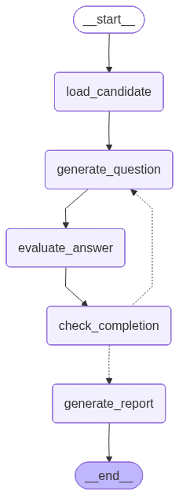
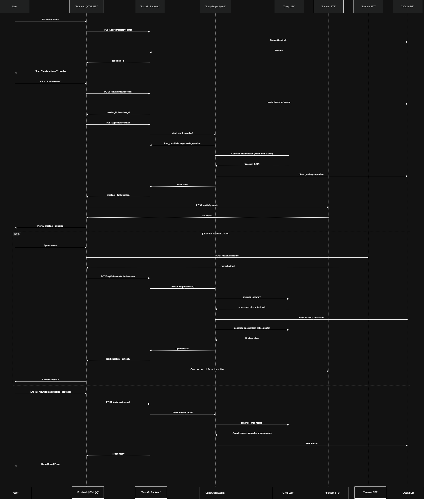
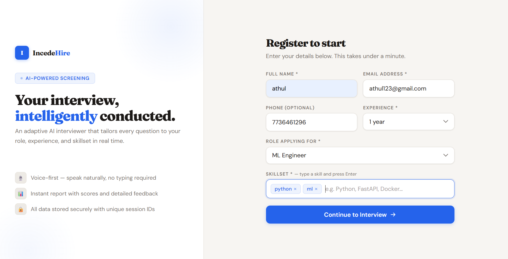
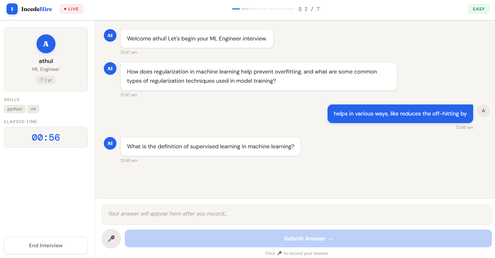
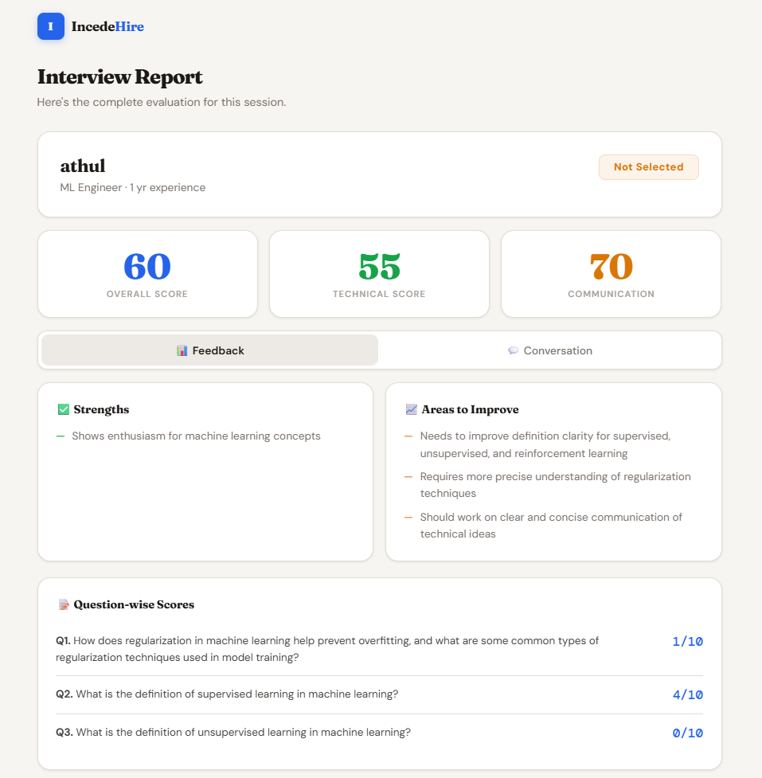

# AI Interview Bot

A voice-based automated technical interview system built with **FastAPI**, **LangGraph**, and **Groq**. Candidates register their profile, speak their answers aloud, and receive a structured performance report — all without a human interviewer in the loop.

The bot adapts question difficulty and cognitive depth in real time using **Bloom's Taxonomy**, transcribes speech with **Sarvam AI STT**, and reads questions back with **Sarvam AI TTS**.

---

## How it works

```
Candidate registers → Session created → Interview starts
    → Agent generates question (TTS plays it)
    → Candidate answers (STT transcribes it)
    → Agent evaluates answer, adjusts difficulty & Bloom level
    → Repeat up to 7 questions
    → Final report generated and stored
```

---

## LangGraph agent graph




## Agent nodes

### `load_candidate`
Fetches the candidate's profile (name, role, experience, skillset) from the database at the start of each session. Every downstream node depends on this data, so it always runs first.

### `generate_question`
Calls the Groq LLM to produce the next interview question. It factors in the candidate's role, current difficulty level, Bloom's Taxonomy cognitive level, and the full conversation history so questions are non-repetitive and progressively challenging. The generated question is persisted to the `Conversation` table before returning.

### `evaluate_answer`
Saves the candidate's transcribed answer, then asks the LLM to score it (0–100) and decide whether to increase, maintain, or decrease question difficulty. If the score is ≥ 85, the Bloom level advances one step upward (e.g. *understand → apply*); if it is < 50, it steps back. This creates a fully adaptive interview loop.

### `check_completion`
A lightweight decision node with no LLM call. It compares `question_number` against `max_questions` (default 7) and sets `is_complete = True` when the limit is reached. The LangGraph conditional edge then routes to either `generate_question` or `generate_report`.

### `generate_report`
The terminal node. It fetches the full conversation from the database, passes it to the LLM, and receives a structured report containing overall score, technical score, communication score, strengths, areas for improvement, and a hiring recommendation (*Hire / On Hold / Reject*). The report is written to the `Report` table once, guarded against duplicates.

---

## Models & external services

| Component | Provider | Model / Endpoint |
|-----------|----------|-----------------|
| LLM (question gen, evaluation, report) | [Groq](https://groq.com) | `llama-3.3-70b-versatile` |
| Speech-to-text | [Sarvam AI](https://sarvam.ai) | `saarika:v2.5` — `en-IN` |
| Text-to-speech | [Sarvam AI](https://sarvam.ai) | `bulbul:v3` — speakers `priya` / `rahul` |
| Agent orchestration | [LangGraph](https://langchain-ai.github.io/langgraph/) | `StateGraph` with conditional entry point |
| Web framework | [FastAPI](https://fastapi.tiangolo.com) | Async, with Jinja2 templates |
| Database | SQLite (via `aiosqlite` + SQLAlchemy async) | Local file `interview.db` |

---

## Project structure

```
interview bot/
│
├── app/
│   ├── main.py                     # FastAPI app, middleware, router registration
│   ├── config.py                   # Pydantic settings (reads .env)
│   ├── database.py                 # Async SQLAlchemy engine + session factory
│   ├── models.py                   # ORM models: Candidate, InterviewSession, Conversation, Report
│   ├── schemas.py                  # Pydantic request/response schemas
│   ├── exceptions.py               # Custom exception classes + FastAPI handlers
│   │
│   ├── agents/
│   │   ├── state.py                # AgentState TypedDict (shared across all nodes)
│   │   ├── graph.py                # LangGraph graph builder + route_phase / route_after_completion
│   │   ├── generate_graph.py       # Utility to export a graph visualisation image
│   │   └── nodes/
│   │       ├── load_candidate.py   # Node 1 — fetch candidate from DB
│   │       ├── generate_question.py # Node 2 — LLM question generation (Bloom-aware)
│   │       ├── evaluate_answer.py  # Node 3 — LLM scoring + difficulty & Bloom adaptation
│   │       ├── check_completion.py # Node 4 — decide continue or finish
│   │       └── generate_report.py  # Node 5 — LLM final report + DB persist
│   │
│   ├── routers/
│   │   ├── candidate.py            # POST /api/candidate — register candidate
│   │   ├── interview.py            # POST session / start / submit-answer / end  GET report / conversation
│   │   ├── stt.py                  # POST /api/stt — Sarvam speech-to-text
│   │   ├── tts.py                  # POST /api/tts — Sarvam text-to-speech
│   │   └── reflection.py           # GET /api/reflect — agent state introspection
│   │
│   └── services/
│       ├── groq_service.py         # LLM wrappers: generate_interview_question, evaluate_answer, generate_final_report
│       ├── sarvam_stt.py           # Sarvam STT HTTP client (saarika:v2.5)
│       └── sarvam_tts.py           # Sarvam TTS HTTP client (bulbul:v3)
│
├── templates/
│   ├── index.html                  # Registration UI
│   ├── interview.html              # Live interview UI (audio recording + playback)
│   └── interview_report.html       # Report display UI
│
├── static/
│   ├── css/style.css
│   └── js/app.js
│
├── audio/                          # Generated TTS WAV files (served as static)
├── interview.db                    # SQLite database (auto-created on first run)
├── graph_image.png                 # LangGraph visualisation (generated by generate_graph.py)
├── .env                            # API keys (see Environment variables below)
├── pyproject.toml
└── README.md
```

---

## Environment variables

Create a `.env` file in the project root:

```env
GROQ_API_KEY=your_groq_api_key_here
SARVAM_API_KEY=your_sarvam_api_key_here
DATABASE_URL=sqlite+aiosqlite:///./interview.db
```

---

## Running the project

```bash
# Install dependencies (requires Python 3.12+)
pip install uv
uv sync

# Start the server
uvicorn app.main:app --reload
```

Then open `http://localhost:8000` in your browser.

---

## API overview

| Method | Endpoint | Description |
|--------|----------|-------------|
| `POST` | `/api/candidate` | Register a new candidate |
| `POST` | `/api/interview/session` | Create an interview session |
| `POST` | `/api/interview/start` | Start the interview, get first question |
| `POST` | `/api/interview/submit-answer` | Submit an answer, get next question or report |
| `POST` | `/api/interview/end` | End interview early, trigger report |
| `GET`  | `/api/interview/report/{session_id}` | Retrieve the final report |
| `GET`  | `/api/interview/conversation/{session_id}` | Retrieve full conversation log |
| `POST` | `/api/stt` | Speech-to-text (audio → transcript) |
| `POST` | `/api/tts` | Text-to-speech (text → WAV audio URL) |

---

## Visuals

### Sequence diagram


---

### Screenshots

## Registration



## Live interview



## Interview report



---